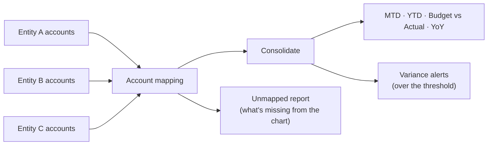

# Power BI / Fabric multi-entity consolidation

[](https://github.com/derekgallardo01/powerbi-fabric-consolidation/actions/workflows/ci.yml) [](LICENSE) [](#)

**Live demo:** [derekgallardo01.github.io/powerbi-fabric-consolidation](https://derekgallardo01.github.io/powerbi-fabric-consolidation/) — three rendered dashboards (campgrounds default, campgrounds with tight variance threshold, and three-hotel hospitality), generated on every push.

Consolidate several companies with **different charts of accounts** into one
executive view — MTD, YTD, Budget vs Actual, prior-year comparison, **variance
alerts**, an **unmapped-account report**, and a **per-entity drill-down** —
then build it for real in Microsoft Fabric / Power BI with the included DAX
library.

The consolidation logic runs fully offline here: `python run.py` ingests three
mock entities, maps them to one standardized chart, renders an HTML dashboard,
and emits per-entity + unmapped-accounts CSVs the bookkeeper can act on.

```bash
python run.py                                 # default run → out/dashboard.html + 3 CSVs
python cli.py --as-of 2026-03                 # earlier reporting period
python cli.py --variance-threshold 2.5        # tighter alert cutoff
python evals/run.py                           # 10 numeric eval cases, CI-gating
python -m pytest -q                           # 10 unit tests
```

Pure stdlib Python (csv only — no pandas).

## Run in Docker

```bash
docker build -t powerbi-fabric-consolidation .
docker run --rm -v $(pwd)/out:/app/out powerbi-fabric-consolidation                                # default run; dashboard.html lands in ./out
docker run --rm -v $(pwd)/out:/app/out powerbi-fabric-consolidation python cli.py --data data-hospitality   # hospitality variant
docker run --rm powerbi-fabric-consolidation python evals/run.py                                   # campgrounds eval set
docker run --rm powerbi-fabric-consolidation python evals/run.py golden-hospitality.json data-hospitality   # hospitality eval set
```

## The problem it solves

An owner runs several entities, each with its own bookkeeping and slightly
different account names ("Wages" vs "Payroll" vs "Labor"). Getting one
consolidated P&L means hours of manual spreadsheet work every month, and the
numbers never quite tie out — usually because a new source account quietly
appeared on one entity's GL and nobody noticed. This maps every entity to a
single standardized chart, surfaces the unmapped accounts so they get fixed
instead of dropped, and flags categories whose variance exceeds a threshold.



## Architecture in one paragraph

`load_facts(data_dir)` returns `(facts, unmapped)` — facts are the joined,
categorised transactions; unmapped is every `(entity, source_account)` combo
the chart of accounts didn't cover, aggregated by total amount. `build_report`
computes the executive measures (YTD / MTD / PY / YoY / variance) per category
and flags rows where `|variance%|` exceeds `variance_threshold` (default 10%);
`build_per_entity_report` is the drill-down (`{(entity, category): YTD}`).
`render_html` ties them together in a self-contained dashboard with KPI cards,
alert banner, per-category table (with ALERT badges), per-entity matrix, and
unmapped-accounts table. Full diagrams + per-component notes:
[docs/architecture.md](docs/architecture.md).

## Sample output

```text
As of 2026-06 | entities: KOA North, KOA Pines, KOA River
YTD Revenue $732,240 | Expenses $402,732 | Net $329,508
Variance threshold: +/-10.0%  |  0 unmapped account(s)  |  0 alert(s)
  Revenue    YTD $   732,240 vs budget +3.1%  YoY +8.0%
  Payroll    YTD $   274,590 vs budget +3.1%  YoY +8.0%
  Marketing  YTD $    73,224 vs budget +3.1%  YoY +8.0%
  Utilities  YTD $    54,918 vs budget +3.1%  YoY +8.0%
```

Captured run including a tight-threshold alert demo, per-entity matrix, and
a synthetic unmapped-accounts scenario: [docs/sample-run.txt](docs/sample-run.txt).
Open [`out/dashboard.html`](#) after `python run.py` to view the rendered dashboard.

## Evaluation

Two datasets ship in the repo to prove the engine works on more than one
industry (same code, different chart of accounts and seasonality):

- **Campgrounds** — 3 KOA entities, 10 cases in [evals/golden.json](evals/golden.json) against [data/](data/).
- **Hospitality** — 3 hotel properties, 11 cases in [evals/golden-hospitality.json](evals/golden-hospitality.json) against [data-hospitality/](data-hospitality/). Hotels run an *unfavourable* budget (variance < 0) — proves the engine flags that direction too.

```bash
$ python evals/run.py
Eval (golden.json): 10/10 passed (100%)

$ python evals/run.py golden-hospitality.json data-hospitality
Eval (golden-hospitality.json): 11/11 passed (100%)
```

How to add cases (real-client totals, identities-vs-numbers,
capture-bug-immediately) is in [docs/evaluation.md](docs/evaluation.md).

## Customization

Six typical tuning points — account mapping, reporting period, new category,
per-category variance thresholds, live source connector (QuickBooks / Xero /
NetSuite), tying the offline engine to the DAX library — are walked through
in [docs/customization.md](docs/customization.md).

## What's inside

| Path | Purpose |
|------|---------|
| [generate_data.py](generate_data.py) | Builds the three mock entities (deterministic). |
| [consolidate.py](consolidate.py) | The engine: `load_facts`, `build_report`, `build_per_entity_report`, `unmapped`, CSV writers. |
| [run.py](run.py) | Default demo: writes `dashboard.html` + 3 CSVs to `out/`. |
| [cli.py](cli.py) | `--as-of`, `--variance-threshold`, `--data`, `--out` overrides. |
| [dax-library.md](dax-library.md) | DAX measures (YTD, MTD, PY, YoY, Budget vs Actual) for the real Power BI / Fabric model. |
| [account-mapping.example.csv](account-mapping.example.csv) | Template for mapping a client's accounts to the standard chart. |
| [tests/](tests/) | 10 pytest tests including unmapped, per-entity, threshold, AS_OF window behaviour. |
| [evals/](evals/) | 10 numeric/identity eval cases + CI-gating runner. |
| [docs/](docs/) | Architecture, customization, and evaluation guides. |

## Taking it to a real client

Build the model in Microsoft Fabric / Power BI, refreshing from the client's
real QuickBooks (or other) companies, using the measures in
[dax-library.md](dax-library.md) and their account mapping. The offline run is
the proof of the consolidation logic — and the unmapped-accounts CSV is what
you hand the bookkeeper before the first monthly close so the production model
ties out from day one.
