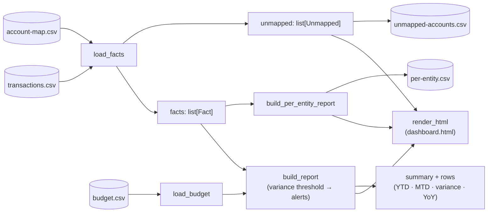
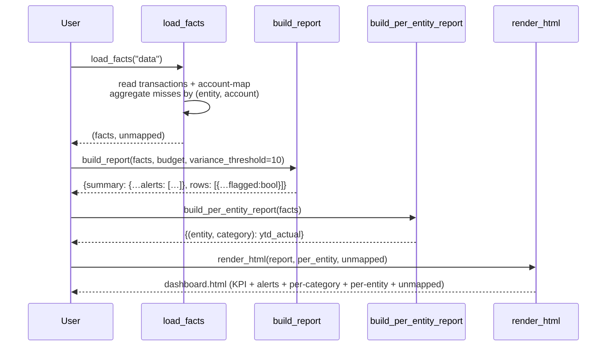
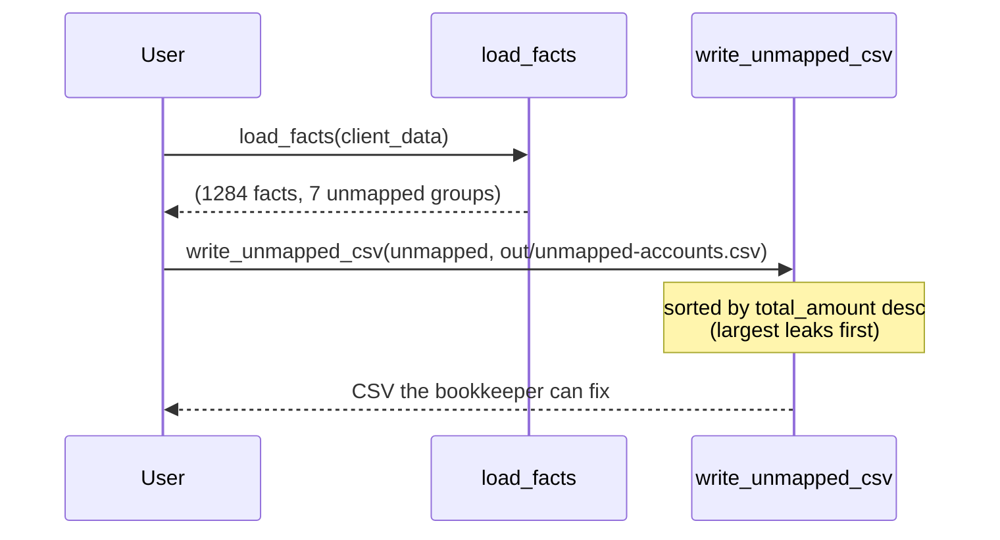

# Architecture

A small, csv-only pipeline that maps each entity's chart of accounts to a single
standardized chart, builds a consolidated fact table, and computes the executive
measures (YTD, MTD, Budget vs Actual, Prior Year, YoY). The offline engine
mirrors what the real Microsoft Fabric / Power BI model does — the
[dax-library.md](../dax-library.md) is the production equivalent of the measures
computed here.

## Components

| Piece | Lives in | Job |
|-------|----------|-----|
| `load_facts` | [consolidate.py](../consolidate.py) | Joins transactions to the account map. Returns `(facts, unmapped)` so misses are visible, not silently dropped. |
| `load_budget` | [consolidate.py](../consolidate.py) | Pivots `budget.csv` to `{(category, year, month): amount}`. |
| `build_report` | [consolidate.py](../consolidate.py) | Computes YTD, MTD, PY, YoY, variance per category; flags rows where \|variance%\| exceeds `variance_threshold`. |
| `build_per_entity_report` | [consolidate.py](../consolidate.py) | `{(entity, category): YTD amount}` — the drill-down behind the consolidated row. |
| `write_unmapped_csv` / `write_per_entity_csv` / `write_consolidated_csv` | [consolidate.py](../consolidate.py) | Persist each artefact as CSV (UTF-8). |
| `render_html` | [run.py](../run.py) | Self-contained dashboard with KPI cards, alert banner, per-category table (with ALERT badges), per-entity matrix, unmapped-accounts table. |
| CLI | [cli.py](../cli.py) | `--as-of YYYY-MM`, `--variance-threshold`, `--data`, `--out`. |
| DAX library | [dax-library.md](../dax-library.md) | The same measures as DAX expressions for the production Power BI model. |
| Eval harness | [evals/](../evals/) | 10 numeric cases (entities, totals, alert counts at thresholds, per-entity sum identity, YTD monotonicity, net identity). |

## Turn sequence — monthly run

## Turn sequence — handing unmapped accounts to the bookkeeper

## Why the design looks like this

- **Unmapped accounts are surfaced, not skipped.** Silently dropping
  unrecognised accounts is the #1 reason "consolidated totals don't tie out"
  — the bookkeeper assumes everything is included until a quarter-end review
  catches it. Returning the misses lets the dashboard flag them and the CSV
  go straight to whoever can fix the chart of accounts.
- **`build_report` is parameterised, not module-globals.** `as_of_year`,
  `as_of_month`, and `variance_threshold` are all arguments. The module-level
  constants are defaults for the demo; the CLI passes overrides without
  mutating state.
- **Alerts are derived from the same numbers, not a separate calculation.**
  Each row computes `flagged = abs(variance_pct) > threshold` and the summary
  collects them. Two views of one truth.
- **Per-entity sums must equal consolidated totals** by construction. The
  per-entity report aggregates the same `Fact` list; the eval harness asserts
  this identity to catch drift if the aggregation logic ever changes.
- **No pandas.** The dataset is small (CSV in, CSV out) and avoiding pandas
  keeps the runtime cold-start trivial — important when this runs in an Azure
  Function or similar serverless context. A real Fabric model uses DAX over a
  semantic layer; the Python here is the unit-testable spec.

## Where to look first if something goes wrong

| Symptom | Look here |
|---------|-----------|
| "The numbers don't tie out" | Run with the default settings and check `out/unmapped-accounts.csv` — almost always there's a new source account the chart of accounts is missing. |
| Wrong YTD totals | `AS_OF_YEAR`/`AS_OF_MONTH` defaults in [consolidate.py](../consolidate.py), or `--as-of` if running via CLI. |
| Variance alerts firing on every category | `--variance-threshold` is too tight for the dataset. Tune by running with a few different values; default is 10%. |
| Per-entity totals don't match the consolidated row | If you've changed `build_per_entity_report`, run `python evals/run.py` — the `per-entity-sums-match-consolidated` case will report the per-category mismatch. |
| Dashboard renders but missing alert banner / badges | Confirm `report["summary"]["alerts"]` is populated (it only is when at least one row exceeds the threshold) and that `render_html` is reading `r["flagged"]`. |
