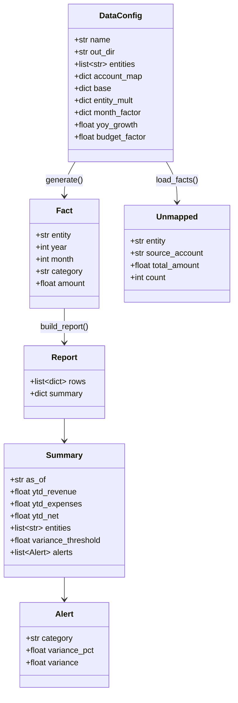
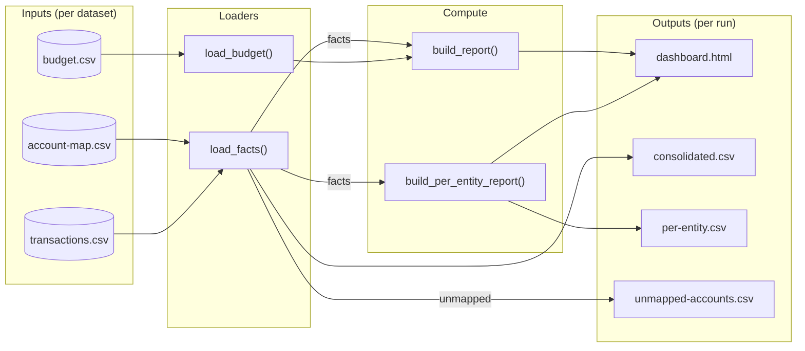
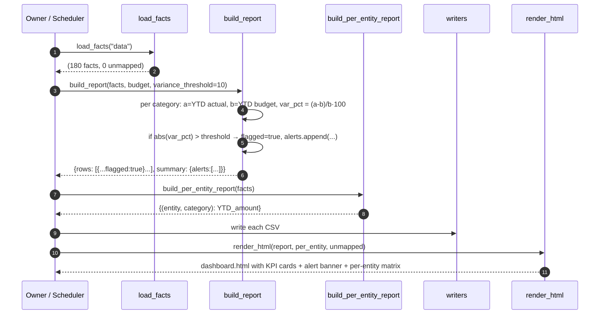
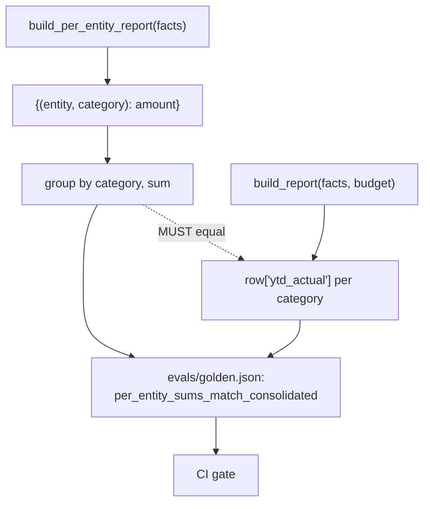

# Diagrams

Beyond the inline ones in [architecture.md](architecture.md).

## 1. Class-ish model — data shapes flowing through the engine

## 2. Data flow — from CSVs through to outputs

## 3. Sequence — monthly run with alerts firing

## 4. Identity — per-entity sums must equal consolidated rows

This identity is the canary — it catches drift if the aggregation logic
ever changes inconsistently between the two functions. The eval case
asserts equality (rounded to 2 dp) for every category in the consolidated
rows.
